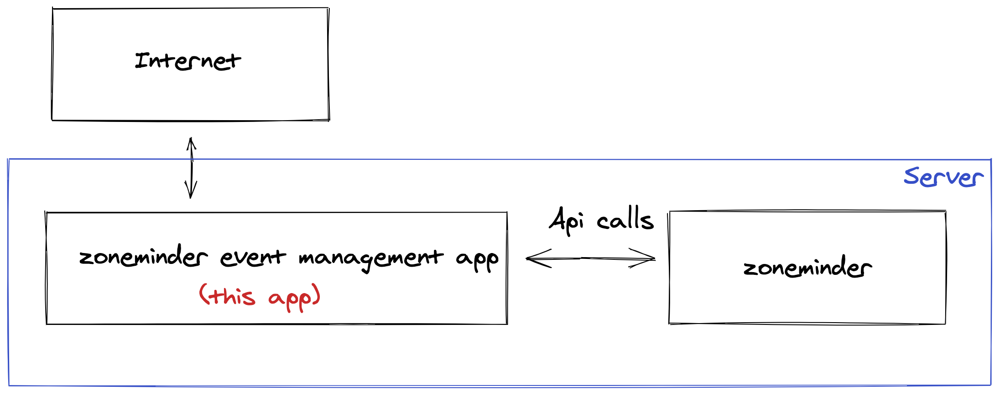

# Manage your zoneminder events
**Why:** I have made this application because I didn't want to expose my zoneminder instance to the internet, while wanting to watch events and be able to remove them.

# Features
- Authentication
- View all events
- Bulk delete events
- Review snapshot image
- Review events video

# Usage
*todo*

# Security

All pages are protected by authentication. 
 
When user submit login form, we send credentials to zoneminder, if credentials are correct, we create a session cookie. Session cookie is encrypted using libsodium.

# Performance
- Snapshots images are **not** downloaded by this application, we only retrieve binary data that we send to frontend. Image are buffered in memory during the process.
- Videos are **not** downloaded by this application, video is retrieved from zoneminder using a streamed http call, the stream is forwarded to frontend. Video are **not** buffered in memory.  

# To improve
As I expect to not have many events, I have not implemented pagination which can be an issue when someone has many events.
